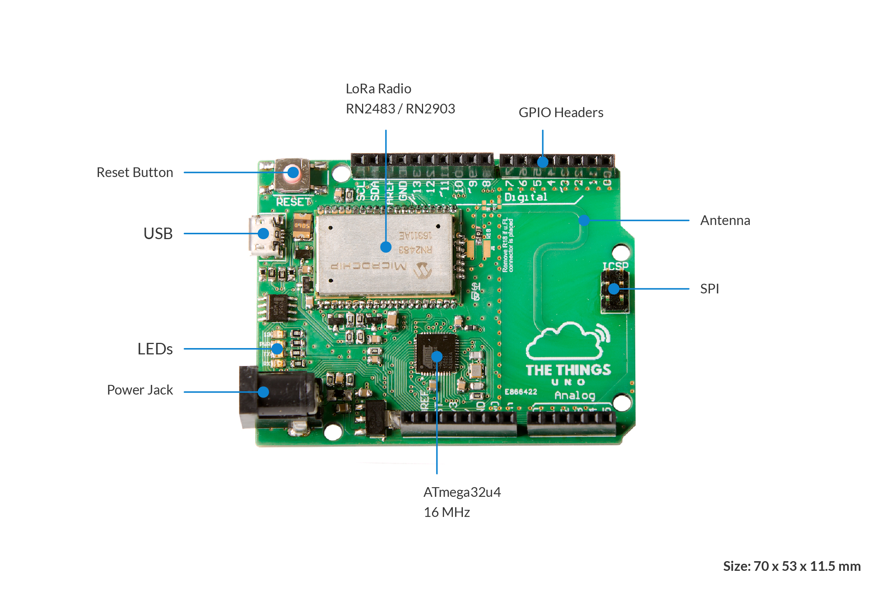
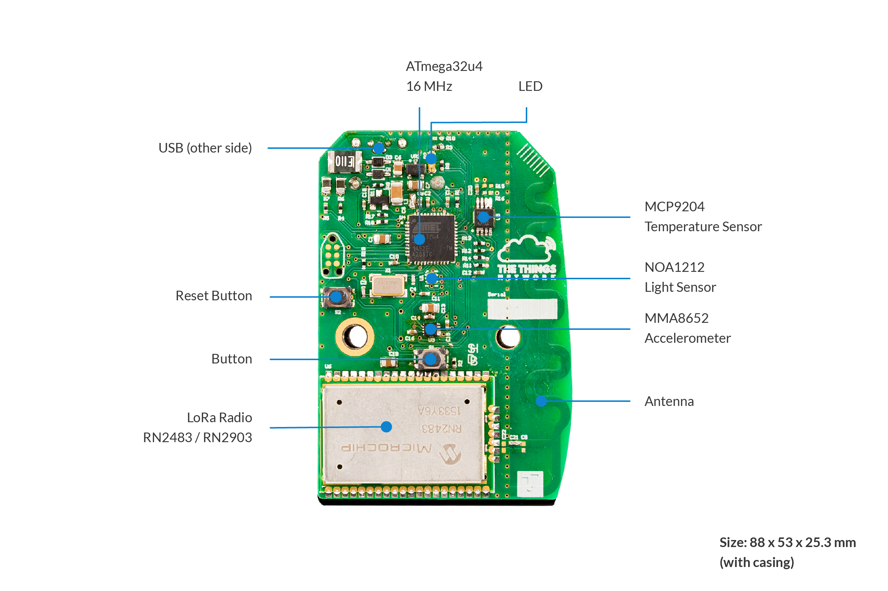

# Hack the world of IoT with the Things Network

The Things Network (TTN) is back at the TNW Hack Battle. Novel Internet of Things technology and abundant data connectivity open up a new world of opportunities. We challenge the tech-savvy and the creative minded people to start exploring the new world of IoT and change the way we use technology. During the hackathon we will use the open standard LoRaWAN.

## About The Things Network

The Things Network is on a mission to build an open, global and crowdsourced Internet of Things data network, owned and operated by its users. In July 2015, The Things Network managed to cover the entire city of Amsterdam with a new type of wireless technology called LoRaWAN (Long Range Wide Area Network). The network was built, bottom-up, funded by its users. Now, hundreds of cities in over 80 countries worldwide are covered and lots of use cases are built on top of it.

## The Things Network support team

Any help neede along the way? Reach out to one of these guys:

## Useful links
* [The Things Network Console](https://console.thethingsnetwork.org/) (developer environment)
* [Official TTN documentation](https://www.thethingsnetwork.org/docs/)
* [The Things Uno documentation](https://www.thethingsnetwork.org/docs/devices/uno/)
* [The Things Node documentation](https://www.thethingsnetwork.org/docs/devices/node/)
* [Fancy dashboard example](ttn.fyi/hackbattle) (login: `tnw` `tnw`)

## Connected Machinegebouw
We've hidden 4 The Things Nodes around the Hack Battle area. All are sending data every now and then which is stored in `InfluxDB` and visualized with `Grafana`. Check out the live data via the link: ttn.fyi/hackbattle. (Login: `tnw` `tnw`)

# Getting started with the Arduino
For you hack, you can make us of **The Things Uno** and connect sensors manually. Or go for **The Things Node** with embedded sensors on the board itself.

### The Things Uno
*The Things Uno is based on the Arduino Leonardo (not the Arduino Uno) with an added Microchip LoRaWAN module. It is fully compatible with the Arduino IDE and existing shields.*

[Read more](https://www.thethingsnetwork.org/docs/devices/uno/)

The Things Uno comes with a fancy sensor kit that includes:
* Infrared sensor (PIR Motion Sensor)
* Accelerometer (ADXL345)
* Temperature & humidity sensor (DHT11)
* Sound sensor (MAX9812)
* Light sensor
* Button
* Breadboard

Not satisfied yet? We brought even more sensors and modules! Let us know if you want to make us of:

**GPS, 16-digit Touch module, Gas sensor, Water sensor, Distance sensor, Air pressure sensor**

### The Things Node
*The Things Node is based off the SparkFun Pro Micro - 3.3V/8Mhz with added Microchip LoRaWAN module and temperature sensor, digital accelerometer, a light sensor, button and RGB LED. All this is packaged in a matchbox-sized waterproof (IP54) casing with 3 AAA batteries to power it.*

[Read more](https://www.thethingsnetwork.org/docs/devices/node/)

# We love social media, do you?
🎉 Did you make some fancy hacks? Let the world know by using `#TheThingsNetwork`

